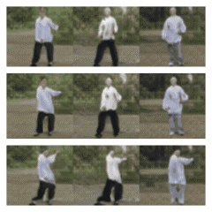
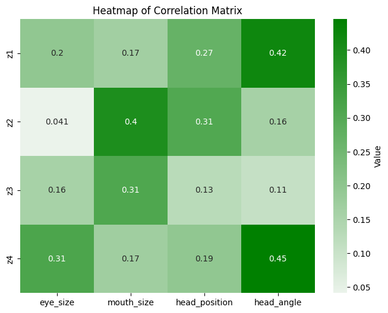
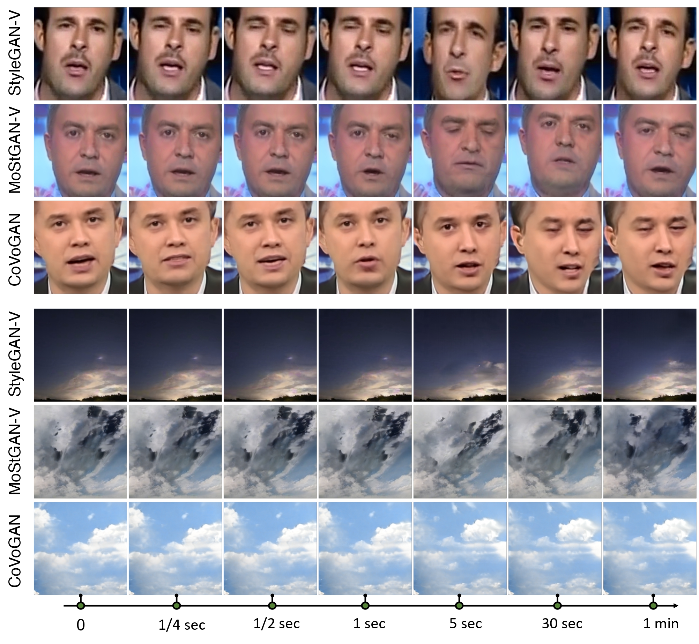

# Figures and Tables for Submission10231

> Figure 1: Controllability visualization results on the TaiChi dataset. To accelerate training, we downsample the resolution to $64^2$. The three columns correspond to different identities. The first two columns show control over the dimension of $z_s$, which corresponds to "turning" and "stretching arms," respectively. The last column shows the simultaneous control of both dimensions.

> Table 1: Mean and standard deviation of FVD16 for RealEstate for 5 runs.

| Method     | Mean     | Std     |
| ---------- | -------- | ------- |
| CoVoGAN    | 193.2060 | 5.3229  |
| StyleGAN-V | 212.0681 | 24.8039 |
| MoStGAN-V  | 254.0751 | 30.0630 |

> Table 2: Disentanglement Metrics on FaceForensics.

| Disentanglement Metrics    | CoVoGAN   | CoVoGAN w/o flow | StyleGAN  | MostGAN   |
| -------------------------- | --------- | ---------------- | --------- | --------- |
| MCC / %  $\uparrow$        | **33.78** | **8.22**         | **29.00** | **27.95** |
| SAP / %  $\uparrow$        | 8.48      | 0.55             | 4.25      | 5.90      |
| Modularity / %  $\uparrow$ | 17.37     | 10.24            | 7.66      | 13.48     |
> Table 3:  $\text{FVD}_{8}$ and $\text{FVD}_{16}$ scores across the FaceForensics, SkyTimelapse, and RealEstate datasets. The results for Latte on the RealEstate dataset are omitted as the checkpoints were not released.

| **Method**         | **FaceForensics $\text{256}^2$** | **FaceForensics $\text{256}^2$** | **SkyTimelapse $\text{256}^2$** | **SkyTimelapse $\text{256}^2$** | **RealEstate $\text{256}^2$** | **RealEstate $\text{256}^2$** |
| ------------------ | :------------------------------: | :------------------------------: | :-----------------------------: | :-----------------------------: | :---------------------------: | :---------------------------: |
|                    |          $\text{FVD}_8$          |        $\text{FVD}_{16}$         |         $\text{FVD}_8$          |        $\text{FVD}_{16}$        |        $\text{FVD}_8$         |       $\text{FVD}_{16}$       |
| **MoCoGAN-HD**     |              140.05              |              185.51              |             1214.13             |             1721.89             |               -               |               -               |
| **DIGAN**          |              57.52               |              61.65               |              60.54              |             105.03              |            182.86             |            178.27             |
| **StyleGAN-V**     |              49.24               |              52.70               |              45.30              |              62.55              |            199.66             |            201.95             |
| **MoStGAN-V**      |              47.67               |              49.85               |              40.97              |              55.36              |            247.77             |            265.54             |
| **VDM**            |             1038.29              |             1046.60              |             1099.21             |             1104.80             |            1524.17            |            1526.04            |
| **LVDM**           |              136.60              |              153.38              |             307.22              |             319.67              |            423.54             |            448.31             |
| **Latte**          |              45.49               |              49.02               |              40.21              |            **41.84**            |               -               |               -               |
| **CoVoGAN (ours)** |            **43.75**             |            **48.80**             |            **35.58**            |              46.51              |          **154.88**           |          **174.87**           |

> Table 4: Video generation performance with different dimensions of $N_s$ by $\text{FVD}_{16}$ of FaceForensics. As shown in the table, by $N_s$ increase, the $FVD$ score decrease slowly, which indicates that $N_s=4$ is a good selection for the FaceForensics dataset.

| Ns  | $\text{FVD}_{16}$ |
| --- | ----------------- |
| 4   | 48.80             |
| 8   | 47.85             |

 > Figure 2: Correlation matric between $z_s$ and extracted features from generated videos for FaceForensics by CoVoGAN.

 > Figure 3: Example of long and short video for.
 
 